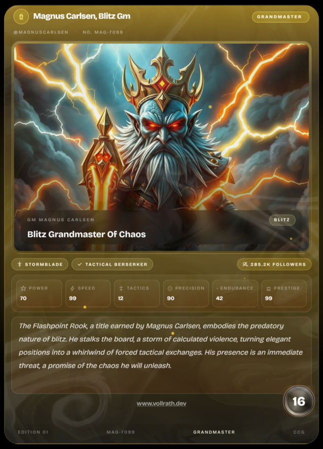

# CTC - Chess.com Trading Card



CTC turns a Chess.com player into a collectible fantasy card using Chess.com public data, derived playstyle stats, AI-generated naming/lore/artwork, and polished animated presentation.

## What It Does

Enter a Chess.com username and the app will:
- fetch public player data from `https://api.chess.com/pub/player/{username}`
- fetch player stats from `https://api.chess.com/pub/player/{username}/stats`
- normalize both responses through the local `/api/chess-player/[username]` route
- derive rarity, power, speed, tactics, precision, endurance, and prestige
- generate chess-themed card names, titles, lore, and portrait prompts
- render the result as an animated card with download and share support

If Chess.com data or AI generation is unavailable, the app falls back gracefully so the card still renders cleanly.

## Features

- Next.js App Router frontend
- Dedicated result pages at `/u/[username]`
- Server-side Chess.com PubAPI proxy with caching and request dedupe
- Deterministic fallback generation for any username
- AI-generated card name, title, lore, and artwork with deterministic fallbacks
- Download as PNG
- Share link UI
- Dynamic metadata and Open Graph image route
- 3D tilt card interaction, shine, glow, and rarity effects

## Stack

- Next.js
- React
- TypeScript
- Tailwind CSS
- Pollinations for image generation
- Pollinations for text generation
- Chess.com PubAPI as the player data source

## Running Locally

```bash
npm install
npm run dev
```

Useful commands:

```bash
npm run lint
npm run build
```

## Environment Variables

```env
POLLINATIONS_API_KEY=your_key_here
POLLINATIONS_TEXT_MODEL=gemini-fast
NEXT_PUBLIC_SITE_URL=http://localhost:3000
CHESSCOM_CONTACT_USERNAME=your_username
CHESSCOM_CONTACT_EMAIL=you@example.com
```

Notes:
- `CHESSCOM_CONTACT_USERNAME` and `CHESSCOM_CONTACT_EMAIL` are used in the server-side Chess.com `User-Agent`.
- Without `POLLINATIONS_API_KEY`, the app still works using deterministic copy and fallback artwork.
- Chess.com requests are proxied through `/api/chess-player/[username]` and cached server-side for Vercel-safe deployment.
- Chess.com data may be cached upstream, so card data is not guaranteed to be real-time.

## Project Structure

- `app/`
  - routes, metadata, OG image route, Chess.com API proxy, result page
- `components/`
  - homepage UI, example card stack, share/download UI, 3D card, card effects
- `lib/creatures/`
  - card types, resolver, rarity/stat mapping, deterministic fallback generator
- `lib/chesscom/`
  - Chess.com fetch + normalization layer
- `lib/artwork/`
  - artwork prompt building, provider, cache, resolver
- `lib/creature-card-copy.ts`
  - AI and fallback generation for card name, title, and lore
- `public/creatures/`
  - local fallback artwork assets

## Status

This is an active MVP focused on:
- polished collectible-card presentation
- chess-native stat mapping and copy
- server-side Chess.com integration
- AI-enhanced card identity and artwork
- resilient fallbacks
- clean Vercel-safe server-side data fetching
